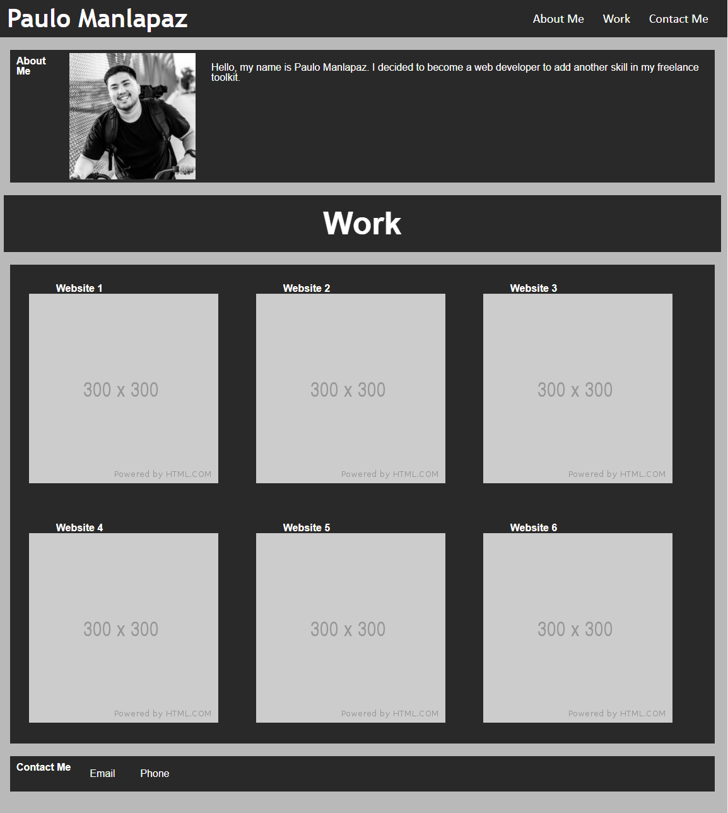

# portfolio-homework-2

# Acceptance Criteria

1) Website contains developer's name, a recent photo, and links to sections about them, their work, and how to contact them.

2) When links in navigation is click the UI scrolls to corresponding section.

3) Developer's first project is larger than other projects.

4) When images are clicked it deploys application.

5) Website resizes to various screens.

# Screenshot of Website
